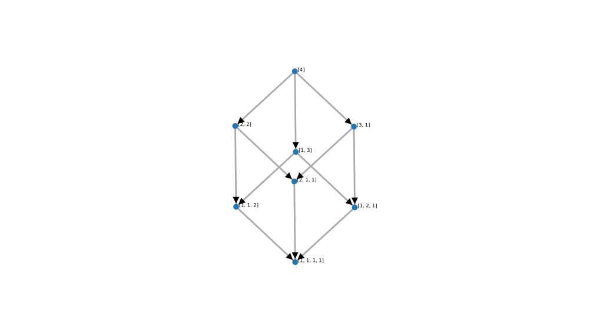
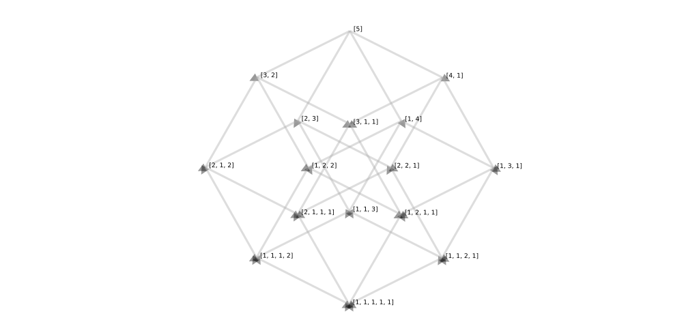
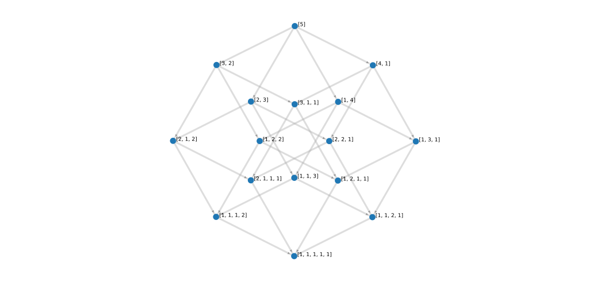

# lattice-obj

Generating ODP presentations (PowerPoint PPT equivalent for Linux) to show a lattice of
integer compositions created by Sage.

“Young's lattice of integer compositions” is a bit of a misnomer, it's actually an
analogue of Young's lattice, Richard Stanley wrote about it [here](http://www-math.mit.edu/~rstan/papers/composet.pdf)
and calls it the "composition poset" (or 'composet')

**However** the poset output by Sage for the integer compositions is _not_ this poset.

In the poset output by Sage's `posets.IntegerCompositions` there are only links between
sets with equal sum (though not necessarily), while in Stanley's "composition poset"
there are no links between sets of equal sum (e.g. 4 and 31)

## Analysis code

### Overview

- Generate integer composition posets in SAGE,
  - as JSON specification (via Sage: `posets.IntegerCompositions.hasse_diagram`)
  - as HTML (via Sage's integration with D3.js: `hasse_diagram.show(method="js")`)
  - as SVG (via D3.js, manually copying the HTML D3 generates into SVG files from the browser DOM
    with 'Inspect element')
- Generate SVG that matches the above Sage-generated SVG
  - Bypass manual copying-SVG-from-the-DOM, producing SVG from a Hasse diagram specification
- Generate an ODP slide drawing that matches the imported SVG
  - Bypass manual SVG import, allowing automated creation of ODP presentations which can be
    arranged freely to explore the integer compositions

### Generate poset JSON in Sage

If you want to generate a D3.js HTML file with the Young's lattice of partitions
of the integer 4, it's not possible to bypass the matplotlib output unless you override
the poset-level `show` and use the `show` method of its `hasse_diagram` method-derived
class (a `HasseDiagram` instance), but this will not be arranged with nodes of equal
rank at equal height (as a poset Hasse diagram should be):

```py
x = posets.IntegerCompositions(4)
h = x.hasse_diagram()
h.show(method="js",link_distance=200)
# Outputs a Hasse diagram arranged by a 'spring' layout algorithm
```

To get the proper positions, you can use the `rank_function` of the poset, calling
it with the `z` value of the vertex index [in `range(len(HasseDiagram.vertices()))`],
to obtain the rank for each vertex, then calculate heights from these levels, and scale
the x values according to the aspect ratio of poset height to width, so 'wide' posets
allocate more spacing and 'narrow' posets do not unnecessarily spread out on the x axis.

- See [`hasse.py`](hasse.py)⠶`hasse_coords` for the implementation

We can then reinstantiate the `GenericGraph` base class of the `HasseDiagram` instance,
and provide these positions as the `pos` argument to the class constructor.

- The function [`sage_poset_hasse.py`](sage_posset_hasse.py)⠶`integer_composition_graph`
  demonstrates this functionality, calling `sage.graphs.generic_graph.GenericGraph.show`

This is all very nice, but we don't want to `show` it, we just want the JSON which is
used to generate the output (but it does help to be able to 'preview' it in the browser).
In fact, we don't need to open the browser at all, we can just generate the HTML code
and process that into SVG, bypassing the D3.js dependency entirely.

- Further on, it would be useful to bypass the HTML generation but this is not exposed,
  so would probably require a little figuring out I'd rather not do immediately.

The HTML can be generated with the `sage.graphs.graph_plot_js.gen_html_code` function,
which outputs a string indicating the location of the HTML file (and does not launch a
browser to view it unlike `show`).

We can pull out the JSON and load it back into Python (a little temporary file never hurt
anyone) and generate the SVG from this specification exactly as D3 would.

- See section 'how D3 generates SVG' below, after the section on manually obtaining the
  resulting SVG from the DOM

### Manually obtaining SVG

The above step can be followed by manually extracting the SVG from the HTML file to
figure out how to produce an SVG to that specification (or not).

I then manually copied the HTML node `<svg>` and put it in the file `y4.svg`,
since it turns out the output of the Python method involved here is just

- Specifically:
  [`sage/graphs/graph_plot_js.py`](https://github.com/sagemath/sage/blob/master/src/sage/graphs/graph_plot_js.py)
  has a function which replaces a comment line in a HTML file
  - `~/miniconda/envs/sage/share/sage/ext/graphs/graph_plot_js.html` is where the HTML file is for me
- It replaces this comment with a JSON encoded dictionary

```py
string = JSONEncoder().encode({"nodes": nodes,
			   "links": edges,
			   "loops": loops,
			   "pos": pos,
			   "directed": G.is_directed(),
			   "charge": int(charge),
			   "link_distance": int(link_distance),
			   "link_strength": int(link_strength),
			   "gravity": float(gravity),
			   "vertex_labels": bool(vertex_labels),
			   "edge_labels": bool(edge_labels),
			   "vertex_size": int(vertex_size),
			   "edge_thickness": int(edge_thickness)})
```

which looks like this:

```json
{"nodes": [{"name": "[4]", "group": "0"}, {"name": "[3, 1]", "group": "0"}, {"name": "[2, 2]", "group": "0"}, {"name": "[2, 1, 1]", "group": "0"}, {"name": "[1, 3]", "group": "0"}, {"name": "[1, 2, 1]", "group": "0"}, {"name": "[1, 1, 2]", "group": "0"}, {"name": "[1, 1, 1, 1]", "group": "0"}], "links": [{"source": 0, "target": 1, "strength": 0, "color": "#aaa", "curve": 0, "name": ""}, {"source": 0, "target": 2, "strength": 0, "color": "#aaa", "curve": 0, "name": ""}, {"source": 0, "target": 4, "strength": 0, "color": "#aaa", "curve": 0, "name": ""}, {"source": 1, "target": 3, "strength": 0, "color": "#aaa", "curve": 0, "name": ""}, {"source": 1, "target": 5, "strength": 0, "color": "#aaa", "curve": 0, "name": ""}, {"source": 2, "target": 3, "strength": 0, "color": "#aaa", "curve": 0, "name": ""}, {"source": 2, "target": 6, "strength": 0, "color": "#aaa", "curve": 0, "name": ""}, {"source": 3, "target": 7, "strength": 0, "color": "#aaa", "curve": 0, "name": ""}, {"source": 4, "target": 5, "strength": 0, "color": "#aaa", "curve": 0, "name": ""}, {"source": 4, "target": 6, "strength": 0, "color": "#aaa", "curve": 0, "name": ""}, {"source": 5, "target": 7, "strength": 0, "color": "#aaa", "curve": 0, "name": ""}, {"source": 6, "target": 7, "strength": 0, "color": "#aaa", "curve": 0, "name": ""}], "loops": [], "pos": [], "directed": true, "charge": -120, "link_distance": 200, "link_strength": 2, "gravity": 0.04, "vertex_labels": true, "edge_labels": false, "vertex_size": 7, "edge_thickness": 4}
```

...which `jq` formats as:

```json
{
  "nodes": [
    {
      "name": "[4]",
      "group": "0"
    },
    {
      "name": "[3, 1]",
      "group": "0"
    },
    {
      "name": "[2, 2]",
      "group": "0"
    },
    {
      "name": "[2, 1, 1]",
      "group": "0"
    },
    {
      "name": "[1, 3]",
      "group": "0"
    },
    {
      "name": "[1, 2, 1]",
      "group": "0"
    },
    {
      "name": "[1, 1, 2]",
      "group": "0"
    },
    {
      "name": "[1, 1, 1, 1]",
      "group": "0"
    }
  ],
  "links": [
    {
      "source": 0,
      "target": 1,
      "strength": 0,
      "color": "#aaa",
      "curve": 0,
      "name": ""
    },
    {
      "source": 0,
      "target": 2,
      "strength": 0,
      "color": "#aaa",
      "curve": 0,
      "name": ""
    },
    {
      "source": 0,
      "target": 4,
      "strength": 0,
      "color": "#aaa",
      "curve": 0,
      "name": ""
    },
    {
      "source": 1,
      "target": 3,
      "strength": 0,
      "color": "#aaa",
      "curve": 0,
      "name": ""
    },
    {
      "source": 1,
      "target": 5,
      "strength": 0,
      "color": "#aaa",
      "curve": 0,
      "name": ""
    },
    {
      "source": 2,
      "target": 3,
      "strength": 0,
      "color": "#aaa",
      "curve": 0,
      "name": ""
    },
    {
      "source": 2,
      "target": 6,
      "strength": 0,
      "color": "#aaa",
      "curve": 0,
      "name": ""
    },
    {
      "source": 3,
      "target": 7,
      "strength": 0,
      "color": "#aaa",
      "curve": 0,
      "name": ""
    },
    {
      "source": 4,
      "target": 5,
      "strength": 0,
      "color": "#aaa",
      "curve": 0,
      "name": ""
    },
    {
      "source": 4,
      "target": 6,
      "strength": 0,
      "color": "#aaa",
      "curve": 0,
      "name": ""
    },
    {
      "source": 5,
      "target": 7,
      "strength": 0,
      "color": "#aaa",
      "curve": 0,
      "name": ""
    },
    {
      "source": 6,
      "target": 7,
      "strength": 0,
      "color": "#aaa",
      "curve": 0,
      "name": ""
    }
  ],
  "loops": [],
  "pos": [],
  "directed": true,
  "charge": -120,
  "link_distance": 200,
  "link_strength": 2,
  "gravity": 0.04,
  "vertex_labels": true,
  "edge_labels": false,
  "vertex_size": 7,
  "edge_thickness": 4
}
```

...the keys of which `jq -r keys[]` gives as:

```STDOUT
charge
directed
edge_labels
edge_thickness
gravity
link_distance
link_strength
links
loops
nodes
pos
vertex_labels
vertex_size
```

The SVG this was turned into by D3.js is [here](y4.svg) (GitHub says it's invalid and won't display
it but Firefox displays it and Inkscape parses it), and can be converted to a PNG for embedding
below by the command `inkscape -z -w 1024 y4.svg -e y4.png`



- There is far too much whitespace around the margins of the diagram.
- There is an unnecessary `<rect fill="white">`
- The marker end has 'overlap' but this is invisible due to the circle at the end of the marker:
  - `<marker><path>` attribute `d` = `M0,-2L4,0L0,2`
    - The 2nd and 4th parts of the comma-separated value array are non-zero.
    - The 2nd and the 4th scale the anti-clockwise and the clockwise side of the marker respectively,
      and the 2nd also modifies the `L` value which is the 'end' (L = `lineto` i.e. end/destination,
      M = `moveto` i.e. start/origin which stays set to `0` i.e. the same as the `L` value of the
      path the marker is 'marking')
      - (i.e. the clockwise side is the west side if the marker is directed southward,
         or simply the right hand side with respect to the end direction)
      - See [W3schools](https://www.w3schools.com/graphics/svg_path.asp) and
        [Mozilla Tutorial](https://developer.mozilla.org/en-US/docs/Web/SVG/Tutorial/Paths)
        for reference on the `path` element in SVG.
- The marker end `fill` colour is black by default, setting it to `fill="rgb(100,100,100)"` prevents
  it from matching the text, meaning the text labels become unreadable where they overlap the marker.

This gives a 'recipe' for editing the SVG output then: remove the `rect` tag and add a `fill` attribute
to the `marker`⇒`path` tag in the `defs` tag.

We can also generate an SVG from scratch using this template.

I removed parts of the partition diagram of the integer 4 (not a Young's lattice as I said, but I'm
abbreviating it y4 for brevity):

- `y4_min.html` has grey-coloured markers (arrows), 1 node (the supremum), and the 3 paths from it
  - The SVG element is the only child of the `html`⇒`body` tag, its source is `y4_min_pretty.svg`
- `y4_four_nodes.html` has grey-coloured markers (arrows), 4 nodes, and the 3 paths that link them
  - The SVG element is the only child of the `html`⇒`body` tag, its source is `y4_four_nodes_pretty.svg`

Next, for compositions of the integer 5 (I've removed the nodes to emphasise the problem):



Here I decided to change the size of the markers, as they were being shown as way too big when
rendered by Inkscape (but not by Firefox, but still I wanted to avoid it), and I also noticed that
when D3 renders them it gives them partial opacity, so I created a CSS style node underneath the
`<svg>` tag. The result looks much neater, and overlaps are subtly shown by the darker shading.

- The files involved here are `y5_small_markers.png` generated from `y5_small_markers.svg` and
  viewable as a webpage as `y5_small_markers.html`



This is great! However it was obtained by manually jiggling the graph around and letting a force-directed
layout algorithm do the coordinate placement, so it's wonky (note the leftmost and rightmost nodes
are not quite at the same y position).

### Generating node coordinates

**Edit** the following section describes a problem solved above, feel free to skip it.

One solution to this would be to use a library like `networkx` which also implements spring layout with
[fixed position](https://networkx.github.io/documentation/latest/reference/generated/networkx.drawing.layout.spring_layout.html)
nodes, and allow it to position the non-infimum/supremum nodes (over 50 iterations by default).

We can get the nodes of a Hasse diagram from `.vertices()` and the edges from `.edges()` (a list
of 3-tuples of `from_node, to_node, node_label` where `node_label` here is always `None`), and then
substituting the `from_node` and `to_node` with an index of that node in the list of vertices,
so that we end up with a list of 2-tuples [i.e. pairs] of integers, suitable for networkx `Graph`
instantiation.

**However** this isn't really wise, as the specification of a Hasse diagram for an integer partition
lattice can be stated simply: all the partitions of equal length should be plotted at the same
height, such that the height of the supremum is the maximum and the height of the infimum is the
minimum. It is not sensible to enforce identical arc lengths, the answer is much simpler...

The calculation is therefore extremely simple, it's just linear (`np.linspace` will do).

The function `hasse_coords` in `hasse.py` can be used with Sage's Hasse diagrams, like so:

```py
h = posets.IntegerPartitions(6).hasse_diagram()
hasse_coords(h)
```
⇣
```STDOUT
[[(0, (0.5, 0.0))],
 [(1, (0.5, 0.2))],
 [(2, (0.25, 0.4)), (4, (0.75, 0.4))],
 [(3, (0.0, 0.6)), (5, (0.5, 0.6)), (7, (1.0, 0.6))],
 [(6, (0.0, 0.8)), (8, (0.5, 0.8)), (9, (1.0, 0.8))],
 [(10, (0.5, 1.0))]]
```

(This was the `hasse_coords` function described above, which I later added aspect ratio to)

**Edit** the previous section describes a problem solved above, feel free to skip it.

### View SVG tree with svgi

The `npm`-packaged `nodejs` tool `svgi` will similarly print the tree of the SVG file generated from
this JSON specification by the D3.js script, by running `svgi -t y4.svg`:

```STDOUT
svg
└─ g
   └─ g
      ├─ rect
      ├─ path
      ├─ path
      ├─ path
      ├─ path
      ├─ path
      ├─ path
      ├─ path
      ├─ path
      ├─ path
      ├─ path
      ├─ path
      ├─ path
      ├─ circle
      │  └─ title
      ├─ circle
      │  └─ title
      ├─ circle
      │  └─ title
      ├─ circle
      │  └─ title
      ├─ circle
      │  └─ title
      ├─ circle
      │  └─ title
      ├─ circle
      │  └─ title
      ├─ circle
      │  └─ title
      ├─ text
      ├─ text
      ├─ text
      ├─ text
      ├─ text
      ├─ text
      ├─ text
      ├─ text
      └─ defs
         └─ marker
            └─ path
```

The challenge now is to figure out how the JSON determines the SVG...

If we add the flag `--ids`, only the penultimate node (`marker`) has an id
(`#directed`), but if we use the flag `--props` we see various properties:

```STDOUT
svg | width=1334 height=735 pointer-events=all 
└─ g | 
   └─ g | transform=translate(47.8483... 
      ├─ rect | x=-10000 y=-10000 width=20000 height=20000 fill=white 
      ├─ path | class=link directed marker-end=url(#directed) style=stroke: rgb(170, ... d=M666.376991707682... 
      ├─ path | class=link directed marker-end=url(#directed) style=stroke: rgb(170, ... d=M666.376991707682... 
      ├─ path | class=link directed marker-end=url(#directed) style=stroke: rgb(170, ... d=M666.376991707682... 
      ├─ path | class=link directed marker-end=url(#directed) style=stroke: rgb(170, ... d=M810.389868041940... 
      ├─ path | class=link directed marker-end=url(#directed) style=stroke: rgb(170, ... d=M810.389868041940... 
      ├─ path | class=link directed marker-end=url(#directed) style=stroke: rgb(170, ... d=M520.898644950828... 
      ├─ path | class=link directed marker-end=url(#directed) style=stroke: rgb(170, ... d=M520.898644950828... 
      ├─ path | class=link directed marker-end=url(#directed) style=stroke: rgb(170, ... d=M664.892233574425... 
      ├─ path | class=link directed marker-end=url(#directed) style=stroke: rgb(170, ... d=M668.581599973266... 
      ├─ path | class=link directed marker-end=url(#directed) style=stroke: rgb(170, ... d=M668.581599973266... 
      ├─ path | class=link directed marker-end=url(#directed) style=stroke: rgb(170, ... d=M812.524124993109... 
      ├─ path | class=link directed marker-end=url(#directed) style=stroke: rgb(170, ... d=M523.077534533065... 
      ├─ circle | class=node r=7 style=fill: rgb(31, 119... cx=666.3769917076821 cy=134.73103756664625 
      │  └─ title | 
      ├─ circle | class=node r=7 style=fill: rgb(31, 119... cx=810.3898680419409 cy=269.7125742360677 
      │  └─ title | 
      ├─ circle | class=node r=7 style=fill: rgb(31, 119... cx=520.8986449508284 cy=268.1542229405705 
      │  └─ title | 
      ├─ circle | class=node r=7 style=fill: rgb(31, 119... cx=664.892233574425 cy=403.5621268126448 
      │  └─ title | 
      ├─ circle | class=node r=7 style=fill: rgb(31, 119... cx=668.5815999732662 cy=331.4188556805278 
      │  └─ title | 
      ├─ circle | class=node r=7 style=fill: rgb(31, 119... cx=812.5241249931095 cy=466.8549120446366 
      │  └─ title | 
      ├─ circle | class=node r=7 style=fill: rgb(31, 119... cx=523.0775345330653 cy=465.28423876421226 
      │  └─ title | 
      ├─ circle | class=node r=7 style=fill: rgb(31, 119... cx=667.0884150720784 cy=600.2903513213034 
      │  └─ title | 
      ├─ text | vertical-align=middle x=673.3769917076821 y=134.73103756664625 
      ├─ text | vertical-align=middle x=817.3898680419409 y=269.7125742360677 
      ├─ text | vertical-align=middle x=527.8986449508284 y=268.1542229405705 
      ├─ text | vertical-align=middle x=671.892233574425 y=403.5621268126448 
      ├─ text | vertical-align=middle x=675.5815999732662 y=331.4188556805278 
      ├─ text | vertical-align=middle x=819.5241249931095 y=466.8549120446366 
      ├─ text | vertical-align=middle x=530.0775345330653 y=465.28423876421226 
      ├─ text | vertical-align=middle x=674.0884150720784 y=600.2903513213034 
      └─ defs | 
         └─ marker | viewBox=0 -2 4 4 refX=6 refY=0 markerWidth=4 markerHeight=4 preserveAspectRatio=false orient=auto 
            └─ path | d=M0,-2L4,0L0,2
```

Essentially this is what we need: there are paths (the properties of which `svgi` has cropped, unhelpfully), so
we can use Python's `BeautifulSoup` (version 4 is `bs4`) to "prettify" it (pretty print) to file:

```sh
python -c "from bs4 import BeautifulSoup as bs; soup=bs(open('y4.svg')); h=soup.prettify(); print(h, file=open('y4_pretty.svg', 'w'))"
```

### Figuring out how D3 generates SVG

Looking at the D3.js file Sage uses, it appends an `svg` tag to the `body` of the DOM,
then sets its width and height to those in the JSON, then sets `pointer-events:all` on this
top-level (I don't think these are needed for non-browser SVG as I am looking to make).

- The `width` and `height` are set from `document.documentElement.clientWidth` minus 32px

Next it adds two consecutive `g` grouping tags, the first of which the event listeners get
attached to (`dblclick`, `mousedown`, `touchstart`, `wheel`), and the second of which is the
'structural' and 'responsive' one which the event handlers act on after being triggered by
the event listeners (by changing the `translate` and `scale` values of the `transform` attribute
on this `g` tag).

- The `transform` attr is reassigned to the values of `d3.event.translate` and `d3.event.scale`
  while `drag_in_progress` is `true`.

Inside the `g` tags (which you'll note only existed for the purpose of browser event handling,
not grouping the poset SVG elements in any way), the first element is a `rect` tag, with a
hardcoded `fill="white"` and dimensions of 2000x1000 (2:1 aspect ratio).

- Firstly, this seems silly, as I already determined the aspect ratio of the poset itself,
  surely any 'drawing frame' such as this rect should match that, rather than creating
  unnecessary whitespace.
- Secondly, there is no need to add the white background, this can be transparent (`opacity="0"`).

If you change this `rect` to

```html
<rect opacity="0" x="-10" y="-10" width="20" height="20"></rect>
```

It looks exactly the same. An SVG doesn't need to have big dimensions, obviously. However changing
the `rect` to have these attributes will break the browser zooming function (as the 'frame', sized to the
`clientWidth`, is smaller than the SVG, so it cannot 'zoom in' from this larger size).

Next a function `center_and_scale` applies an
[homothetic transformation](https://en.wikipedia.org/wiki/Homothetic_transformation) (an affine
transformation, i.e. a scaling) of the points if positions are specified.

- Since this will be done in Python it'll be much simpler with `numpy` vectorised functions.

Next all the `path` tags are listed, which may seem unintuitive: links before the nodes they link!
Since `z-index` is not used in SVG, the relative visibility of the elements is determined by the
order in which tags are listed: moving a `circle` element tag to appear before the `path` tags, it
will become partially occluded by the arcs.

- This order is the opposite in photo editing applications (where the base layer is listed last),
  but the principle is the same, and presumably applies to SVG subgroups.

There are 2 possible ways to group the nodes and arcs:

- Group all the nodes, and group all the arcs
  - This would be useful for manipulating all nodes or all arcs at the same time
- Group all nodes with their outbound arcs (the infimum will be in a singleton group with no arcs)
  - This would be useful for manipulating sets of nodes in terms of their connectivity

At first glance, the former seems sensible, however presentation software can probably allow you to
do that fairly easily. The latter on the other hand would allow selection of 'paths' through the
[face lattice](https://en.wikipedia.org/wiki/Convex_polytope#The_face_lattice) with geometrically
meaningful interpretations.

Perhaps this could be left as a parameter to be decided at creation time, but default to the 'connected'
grouping mode.

Next (I don't like this notation!) the SVG variable is used as a selector target using a
non-existent class, `selectAll(".link")` — this confused me at first as there are no items defined
at this point with the `link` class name in the DOM, so what this does is just attach to the SVG
node in the DOM, you could use any string instead of `".link"`, and then

- the JSON data from `graph.links` is appended as `path` tags
  - whose `class` is the string `"link directed"`
  - whose `marker-end` attribute is the string `"url(#directed)"`
  - whose `style` attribute is given a colour (based on the `color` passed for each link)
    - This is redundant variability, as we colour them all the same (`"#aaa"`, a light grey)
  - whose `stroke-width` attribute is the integer `graph.links.edge_thickness` coerced to string + `"px"`

(and then similarly for loops, but there are no loops in our poset so skip this)

Next the same is done for the nodes, from the `graph.nodes` JSON subarray (the JSON becomes the
`graph` variable), each of which becomes a `circle` tag with

- `class` attribute of `"node"`,
- `r` attribute of `graph.vertex_size`
- `style` attribute entry for `fill` (`=`) `color(d.group)`, which assigns a colour based on the
  group, and in our poset they're all the same group so again this is redundant, the colour is
  always assigned as `rgb(31, 119, 180)` from `d3.scale.category10()`
  - This is an ["ordinal" colour scale](https://d3-wiki.readthedocs.io/zh_CN/master/Ordinal-Scales/),
    basically it's far more complicated than we need it to be for this poset.
- ...finally a `title` tag is appended into the inner HTML of the `circle` tag whose inner text is
  the `name` of the node dict.

Next, if `graph.vertex_labels` is `true`, then append a `text` tag for each node:

- `vertical-align` attribute `middle`
- inner text is the `name` of the node dict (as for the `title` tag inside the `circle` tag)

Next, if `graph.edge_labels` is `true`, then append a `text` tag for each edge (and simultaneously,
any loop, but we don't have any):

- `text-anchor` attribute `middle`
- inner text is the `name` of the node dict (as for the `title` tag inside the `circle` tag)

Next, if `graph.directed` is `true`, add a final `defs` tag to the SVG

- inside, add a `marker` tag with the `id` "directed"
- `viewBox` attribute `0 -2 4 4` — bottom-left corner `(0, -2)`, width = height = 4
- `refX` attribute `Math.ceil(2*Math.sqrt(graph.vertex_size))`
  - The comment says `This formula took some time ... :-P` but otherwise unclear why `⌈2√r⌉`
    would be used to find the "reference X" distance
  - I don't see why you wouldn't just set the value to be the radius, so that the marker would
    never touch the vertex (the current result overlaps a little and looks bad with many incident
    edges on a single node).
- `refY` attribute `0`
- `markerWidth` attribute `4`
- `markerHeight` attribute `4`
- `preserveAspectRatio` attribute `false`
- `orient` attribute `"auto"`
- ...finally a `path` tag is appended into the inner HTML of the `marker` tag whose `d`
  attribute is `"M0,-2L4,0L0,2"`
  - Comment: "`triangle with endpoints (0,-2), (4,0), (0,2)`"
  - Note that there is one `M` (moveto) and two `L` (lineto) values, hence a triangle

(A function `line` is defined which interpolates a number array but this is only used if
the value of `curved` is non-`0` for a given node)

Next, vertices get a `cx` and `cy` attribute (c for centre), equal to `d.x` and `d.y`

Next, edges get a `d` attribute, which (for non-curved lines which all of ours are) equals:

- `"M" + d.source.x + "," + d.source.y + " L" + d.target.x + "," + d.target.y;`
  - `d.source` and `d.target` indicate an entry `d` in the JSON `links` list (`graph.links`)
  - `M` (moveto) sets the start of the arc line at the `source.x` value
  - `L` (lineto) sets the end of the arc line at the `target.x` value

(Again we ignore position processing for loops)

Next, vertex labels are positioned as `d.x + graph.vertex_size` (`r=7` here) and `d.y`

Next, edge labels are positioned as `d.source.x` and `d.source.y`

### Viewing the ODP file

Unzip the ODP file into a [newly created] directory `y4_odp_extracted`:

```sh
unzip y4_lattice_sage-d3-generated.odp -d y4_odp_extracted/
```

Inspect the drawing groups:

```sh
cd y4_odp_extracted/
cat content.xml  | xq '. [] . "office:body"[] . "draw:page" .  "draw:g" . "draw:g"[] . "draw:g"[]'
```

Pretty print the content XML for the edited ODP (as a new file, [`y4_manually-grouped-content.xml`](y4_manually-grouped-content.xml).

- This was the file where the SVG was imported and then its components were grouped hierarchically from the supremum downward,
  with the outbound arcs from a given node (i.e. from a given composition) 'grouped' with that node.
  - After all nodes have been grouped to their outbound arcs, the entire set of nodes and arcs is grouped
  - ...then the entire set of nodes/arcs is grouped with the labels (I think

```py
from xml.dom.minidom import parse
p = parse("y4_edited_odp_extracted/content.xml")
print(p.toprettyxml(), file=open("y4_manually-grouped_content.xml", "w"))
```

As a one liner that can be reused:

```sh
python -c "from xml.dom.minidom import parse; print(parse('y4_coloured_odp_extracted/content.xml').toprettyxml(), file=open('y4_manually-coloured_content.xml', 'w'))"
```

Examining this XML, it can be seen that:

- Everything except the `<office:body>` node is generic and can be ignored (as mere 'container')
  - Briefly, they are: document content specification; scripts (i.e. macros: none); font face declarations; text styles; list bullet styles
- The `<office:body>` has a single child node, which is `<office:presentation>` (as this is a presentation file).
- The `<office:presentation>` has 2 child nodes:
  - A `<draw:page>` node
  - A `<presentation:settings>` node
- Presumably there would be multiple `<draw:page>` nodes if there were multiple slides.
- The `<draw:page>` has 2 noteworthy attributes:
  - `draw:master-page-name="Default" meaning it uses the default 'master' template
  - `draw:name="page1"` meaning its title is "page1" (presumably this is parsed to become "Slide 1" but also to allow object-oriented constructions
    such as "Duplicate of Slide 1" when duplicated, etc.

### Editing the ODP file

We have viewed the ODP file archive's contents, and can edit the unzipped archive, but if we just zip it again it'll be considered corrupt and
will not be read by LibreOffice Impress unless we use particular flags (due to a
[change](https://ask.libreoffice.org/en/question/185777/libreoffice-60-unzip-zip-open-document-file/) in LibreOffice around 2019):

> When (re)zipping an ODF document you must ensure that the mimetype file is
> the very first file in the archive and not compressed, it must be plain text.
> If that is not the case (compressed file or different position in the zip
> directory) then it is not a valid ODF file.
>
> To achieve that, easiest is to freshen the existing zip with the modified
> file(s) instead of creating a new zip, i.e. use the `-f` option, for example
> `zip -f /path/to/filename.ods content.xml`
>
> When creating a new zip, add and store only the mimetype file first using the
> `-0` (numeric zero, not letter O) option. Then add other files using the `-u` option.

In other words, don't compress the mimetype as it needs to be readable as plain text,
but rather than supplying each file to compress with the `-f` flag after passing in
`-0 mimetype`, just 'freshen' the existing file you originally decompressed,
since it already contains a `content.xml` so you can just update that in the
compressed archive to be the modified version you just edited.

I tried this and it didn't work, then I went back and noticed this answer
had been corrected further down the discussion:

> The `zip -f ./decompresslib/X.odt ./decompresslib/content.xml` is wrong,
> content.xml must be without path, otherwise there's noting to refresh (and
> adding the file would be wrong). So either the zip command be invoked in its
> (`content.xml`) actual directory `decompresslib/` and omitting the directory, or
> the -j junk directory names option be used, so `zip -f -j ./decompresslib/X.odt ./decompresslib/content.xml`
> (be careful you don't use that with other files that actually need a correct directory prefix).

> The non-matching CRC does not harm, it will be corrected with freshening the zip.

In other words (ignore the name "decompresslib"), if you freshen a zip archive but are not
running the command from (i.e. the working directory) the directory of the extracted file,
then it won't freshen the file, but it also won't tell you it didn't. So instead, this
response suggests to use the `-j` ("junk") option to `zip`,

```
-j
--junk-paths
      Store just the name of a saved file (junk the path),  and  do  not  store
      directory  names.  By  default, zip will store the full path (relative to
      the current directory).
```

I think what this means is, if you try to freshen the file `content.xml` but do so
by calling it from the parent directory `my_cool_dir`, then you won't freshen the `.odp` zip
archive 'subfile' (think of the archive as like a little file system) at `myfile.odp/content.xml`
but at `myfile.odp/my_cool_dir/content.xml`, which didn't exist, so since `freshen` will not
add new files to an archive, it won't do anything, and this is why nothing changed when
`zip -f` was run without `-j`.

The second part of the response warns against using `-j` if the directory path is needed,
in other words if you're storing something in a subdirectory of the archive, but here
`content.xml` is in the 'top-level' of the archive so it doesn't matter, so we can use `-j`
and "junk the path".
